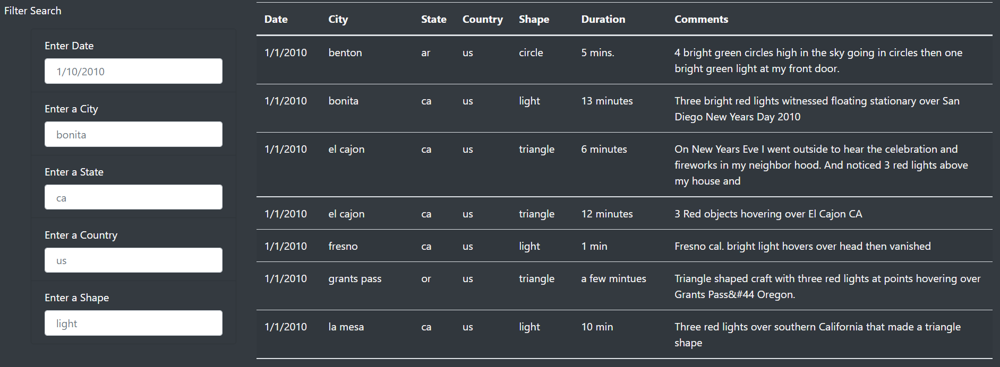
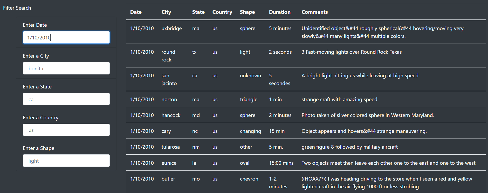
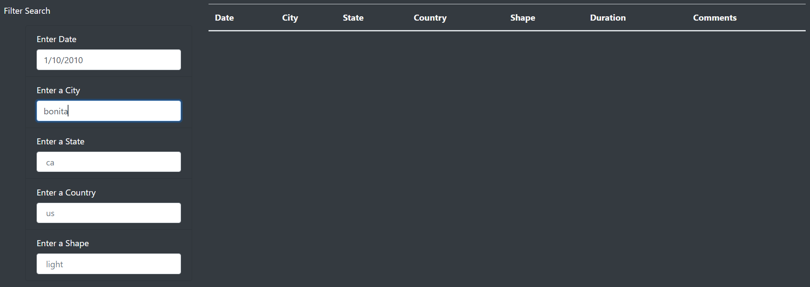
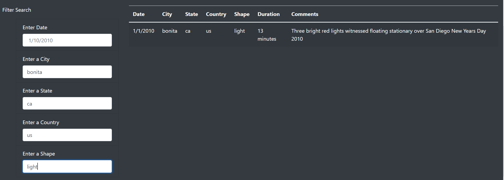
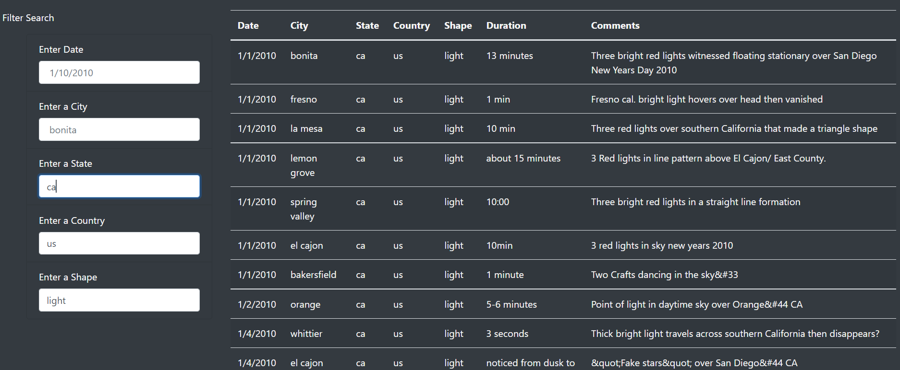

#### Challenge 11: Module 11

# Overview of Project

## Purpose of UFO Analysis

During Module 11, a page was created with Dana to visualize data from UFO. The page was customized and a table with specific data from strange events in different places. The user was able to filter the data by date. The purpose for the analysis in the Challenge was to add more filters for the data table, so the user can specify their search by city, state, country and shape.

# Results

The webpage is easy to use due to the design of the page and its simplicity. The steps to have a specific filter consists in adding what the user is looking for in each square and pressing Enter. Automatically, the table will be generated with new data based on the selected filters. The user can add one filter or all of them, it depends on what the user wants to see. It could be helpful for the user to know the next steps before filtering the table and visualizing how it is going to change each part.

* Step 1:

The first table that the user will see is shown in Image 1. The table contains all the data, there is no filter yet. It could be confused that there are some next inside the white boxes but the next is in color gray, referring to a possible example for each filter. 

###### Image 1. Complete table without filters.

* Step 2:

In Image 2., it can be seen that the table has a filter. The filter was added just by selecting the box below “Enter Date”, and writing the date with a format similar to the one of the example. After having the date, the user just needs to click “Enter” and automatically the table will update with the filter. The table shown only has data with “1/10/2010” as a date.

###### Image 2. Table filtered by date.

* Step 3:

The user can add more than one filter to their search, in Image 3. another filter was added. The user needed to do the same steps explained in Step 2. In this case, after the “Enter”, the table showed no data due to the fact that there is no data with that data and that city.

###### Image 3. Table filtered by date and city.

* Step 4:

The user can modify the filters any time. In Image 4., it can be seen that there is just one row with data in the table. If the user focuses on the filters, the ones that were activated are city, state, country and shape. The filter for date was deleted and the only data that matches the other filters has a date of “1/1/2010”.

###### Image 4. Table filtered by city, state, country, and shape.

* Step 5:

The next example is about having just the filters of state, country and shape. In Image 5. it can be seen that inside the table, the results are correct. There is just data with “ca” as state, “us” as country and “light” as shape.

###### Image 5. Table filtered by state, country, and shape.

# Summary

## Drawback of the webpage

The design of the webpage is overwhelming, the menu of the filters is long. It would be easier to have just one filter where the user can also select the desired filters and then the selected filters could appear with their dropdown menu, like the ones in an online store.

## Recommendations

One recommendation for changes to improve the page in the future is a dropdown menu, so the reader can see the options for each filter.  It is quite difficult to know each option of each filter, while looking at the menu with all the options makes it easier to know what you are looking for. The other recommendation for further development is a section for comments or contact, also a little explanation of what is going on in each section. An index with hyperlinks could also be helpful for the reader to understand the page and select the interested section.
All the recommendations need to be tested and each part will need an update or change. It is important to test the page with different users and listen to their comments about their interaction with the page.

